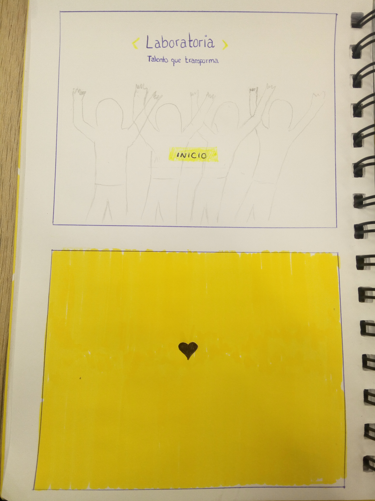
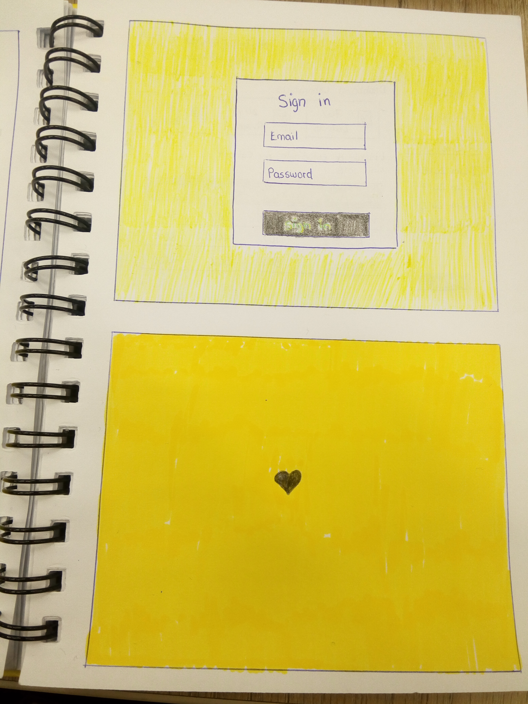
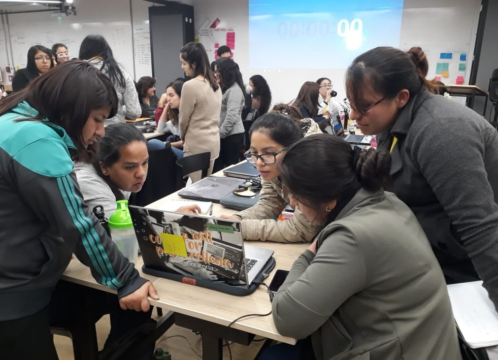
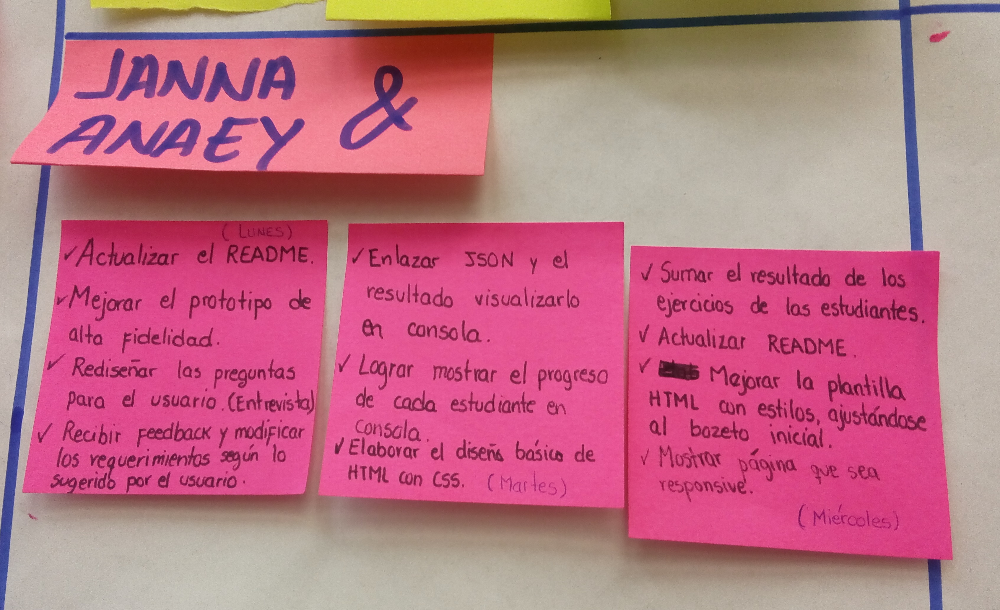

# Data Dashboard

## Introducción

La principal característica de nuestro proyecto es brindar al usuario una herramienta de acuerdo a las necesidades 
que busca, en este caso nuestro usuario objetivo es la Training Manager de Laboratoria, ella al realizar su trabajo
necesita analizar la mayor cantidad de datos posibles respecto al progreso de las estudiantes para apoyarlas en 
su aprendizaje.
Para completar los proyectos dentro de Laboratoria, las estudiantes acceden a contenidos de aprendizaje (lecturas,
videos, ejercicios y quizzes) en un sistema que llamamos LMS (Learning Management System). El LMS acumula data sobre
quién leyó qué, qué ejercicios se han completado, los resultados de los quizzes, etc.

De esta manera la Training Manager puede monitorear el porcentaje de ejercicios completados, nota en quizzes, etc.) 
no impacta directamente en la evaluación de una estudiante, sí es una pieza de información relevante que las TMs
quisieran visualizar para tener un mejor entendimiento de cómo va cada estudiante en su proceso de aprendizaje.

Para lo cual hemos creado un **data dashboard** (_tablero de visualización de datos_) donde el manejo de datos sea 
lo más práctico usar y poder tener una vista panomámica de todas las alumnas de un cohort.

## Objetivos del Dashboard

El producto que presentamos es un Dashboard, cuya usuario específico es la Training Manager de Laboratoria, desde 
esa perspectiva los objetivos del dashboard son esencialmente los siguientes:

* Requiere pocos pasos para ingresar a la Data.
* Maneja pocos gráficos para no confundir al usuario.
* La Data que manipula se distribuye deacuerdo al requerimiento del usuario.
* Posibilita la información precisa para poder conocer los logros y/o deficiencias de cada alumna del Cohort.

## Necesidad del Usuario 

El manejo de la información de la completitud de los exercises, quizzes y reading de las alumnas que tiene la Training 
Manager es a través de una página de Microsoft Excel, de tal manera que muestra un desfase porque en algunas celdas 
que debería mostrar un resultado de los cursos ya no aparece porque se podría haber borrado la función que lleva a las 
celdas necesarias. Además que el archivo demora en cargar toda la información que mostrará.

En esta oportunidad mediante las entrevistas con nuestra Training Manager el panorama del proyecto fue cada vez más 
claro, su enfoque va en lo siguiente, necesita emplear un dashboard que para ingresar a su usuario no requiera muchos 
pasos, y lo más importante es que el Dashboard muestre la lista de alumnas de manera general porque de ese modo podría 
ver el avance completo de cada una de ellas, además que la información se muestre de manera agradable a la vista, 
pidiendo de esta manera manejar la parte responsive de la página web, siendo aplicable a las vistas desde algún equipo 
móvil.

## Solución de Problemas

Este proyecto muestra a los Training Manager la data del cohort que necesitan manipular u observar para cualquier tipo 
de toma de decisiones, además soluciona problemas como son:

* La información no se filtrará debido a que el usuario necesita entrar con su email y password.
* Puede ubicar al cohort que necesita a través de una búsqueda rápida.
* Muestra una vista general del progreso de todas las estudiantes de un cohort.
* La página no se recarga debido a que está conectada a internet.
* Puede tener la información requerida desde cualquier país en que se encuentre, ya que la información no se encuentra estática en alguna red local.
* La presentación es agradable desde cualquier dispositivo móvil o PC, ya sea que necesite ver la información desde 
otros dispositivos.

## Implementación

Punto clave de este proyecto es el trabajo en equipo y colaborativo, somos 2 personas las que trabajamos en ello, 
pero detrás de esto están nuestras compañeras y coaches que apoyaron mucho en su realización. Este proyecto está 
dividido en 3 sprints, de los cuáles hablaremos más adelante de como fue que distribuimos todo nuestro trabajo. 

### Primer Sprint

Al recibir el proyecto sabiamos que nos enfrentabamos a algo más complejo y nuestra misión es no perder de enfoque 
lo que el usuario necesita y busca encontrar en nuestro trabajo, así que empezamos con la distribución de nuestro 
backlog grupal y "manos a la obra". 
Así iniciamos:

#### 1) Prototipo de Baja Fidelidad

El prototipo de Baja Fidelidad lo elaboramos en base a papel y lápiz dónde preparamos los primeros trazos de lo que más 
adelante iniciamos a implementar de acuerdo a las necesidades de nuestra Training Manager, lo cual conocimos a través 
de una primera entrevista.

#### 2) Entrevista a la Training Manager

Con el boceto elaborado de acuerdo a las características del proyecto preparamos una entrevista a nuestra Training 
Manager en la cual consultamos sobre la experiencia de usar nuestra plantilla y lo que desea experimentar al usarla.

#### 3) Prototipo de Alta Fidelidad

El prototipo de Alta fidelidad que usamos lo implementamos en una web que nos gustó como interactúa con el usuario
y su desempeño es muy práctico [Prototipo Marvel](https://marvelapp.com/6gjf5hg/screen/44239254)

#### 4) Recibir Feedback

El proyecto lo trabajamos en squads, por lo tanto es más fácil poder recibir un feedback técnico por su parte, lo cuál
nos ayudó mucho y sirvió para ver algunos puntos más allá de nuestros propios conocimientos.

### Segundo Sprint

Con la presentación de nuestro primer Demo hemos recibido un feedback de nuestro squad y jedi así como de algunos coaches
lo que nos ayudo también a poder desarrollar nuestro siguiente sprint, aclaramos mejor el panorama de lo que estamos
buscando mostrar y planteamos nuestras tareas para el sprint 2.

El desarrollo de nuestras funciones fue el siguiente para lo cual ya colocamos diferentes hitos de tiempo dentro de 
nuestro sprint para poder desempeñar mejor nuestra organización.

#### 1) Elaboración de funciones

Con el prototipo del diseño mostrado en Marvel al que queremos llegar se empezó a llamar la data que tenemos para 
mostrarla a través de las diferentes funciones que son requisitos del proyecto.
Como requisito es usar ES6 el tiempo usado para entender algunas funciones nos demandó de más tiempo.

#### 2) Estructuración del HTML

Con nuestro prototipo listo empezamos a estructurar lo que aparecerá en la pantalla, en un primer inicio lo mostramos 
como una plantilla sin usar CSS para poder mover todo hasta estar seguras del contenido que hemos planteado.

#### 3) Uso de CSS

Como ya tenemos el HTML listo iniciamos a colocar los estilos que necesitabamos para llegar a ser igual al prototipo 
de alta fidelidad que elaboramos.